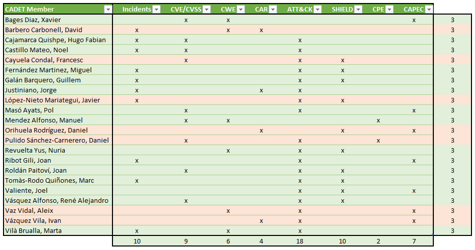

```{r setup, include=FALSE}
knitr::opts_chunk$set(echo = TRUE)
if (!dir.exists("data")) dir.create("data")
if (!dir.exists("data-raw")) dir.create("data-raw")
```


```{r load_packages, echo=FALSE}
suppressPackageStartupMessages(library("dplyr"))
library("tidyr")
library("DataExplorer")
library("ggridges")
library("ggplot2")
library("hrbrthemes")
library("viridisLite")
library("viridis")
library("sjmisc")
library("dplyr")
library("visNetwork")
library("kableExtra")
library("plotly")
```

```{r install_mitre, echo=FALSE}
# devtools::install_github(repo = "motherhack3r/mitre", ref = "devel")
library(mitre)
```

# Introducción

Como miembros del CADET (Cybersecurity Analyst Data Experts Team) se solicita 
vuestra colaboración para el análisis de los incidentes que afectaron con anterioridad.




## Objetivo

El objetivo consiste en responder las siguientes preguntas:

  1. ¿Quien estaba detras de los ataques?
  2. ¿Cual fue el objetivo?
  3. ¿Cómo realizaron los ataques?
  4. ¿Cómo podemos protegernos?
  5. ¿Qué podemos hacer para prevenir futuros ataques?
  6. ¿Sería posible predecir ataques?

## Alcance

Respondiendo 3 preguntas se consigue una puntuación de 5 sobre 10.  
Las siguientes preguntas suman 2 puntos, pudiendo conseguir un máximo de 10.

# Data sets

#```{r mitre_download_feeds, cache=TRUE, echo=FALSE, warning=FALSE, results='hide'}
#mitre::updateRawData(verbose = FALSE)
#```

#```{r mitre_create_datasets, cache=TRUE, echo=FALSE, warning=FALSE, results='hide'}
#mitre.data <- mitre::getMitreNetwork(verbose = F)
#```
```{r ds_mitre, cache=TRUE, echo=FALSE, warning=FALSE, results='hide'}
#mitre.data <- readRDS(file = "data/mitredata.rds")
mitre.data <- mitre::getLatestDataSet()
```

## Incidentes

Load incidents data set and unnest ATT&CK column.

```{r ds_incidents, cache=TRUE, echo=FALSE, warning=FALSE, results='hide'}
raw_incidents <- readRDS(file = "data/incidents.rds")
incidents <- raw_incidents %>% unnest(mitre_attack)
summary(incidents)
```
Analyze character columns to identify unique values.

```{r ds_inc_factors}
apply(incidents, 2, function(x) length(unique(x)))
```

Set character columns as factor.

```{r}
incidents <- incidents %>%
  mutate_if(is.character, as.factor)
summary(incidents)
```
```{r fig.width=8, fig.height=8}
plot_correlation(incidents)
```

Seems that Tactic and Industry values are interesting.
Let's see industry distribution along time.

```{r, warning=FALSE}
# Ref: https://www.r-graph-gallery.com/294-basic-ridgeline-plot.html

ggplot(incidents, aes(x = first_event_ts, y = industry, fill = industry)) +
  geom_density_ridges() +
  theme_ridges() + 
  theme(legend.position = "none")

```
  
The time series distribution is based on first event. We can calculate the duration of the incidents using containment time.

```{r fig.width=8, fig.height=8, warning=FALSE}
# Ref: https://www.r-graph-gallery.com/320-the-basis-of-bubble-plot.html
incidents <- incidents %>% mutate(duration = round(as.numeric(containment_ts - first_event_ts)/3600, 2))

incidents %>%
  arrange(desc(first_event_ts)) %>%
  # mutate(country = factor(country, country)) %>%
  ggplot(aes(x=first_event_ts, y=industry, size=duration, fill=tactic)) +
  geom_point(alpha=0.5, shape=21, color="black") +
  scale_size(range = c(.1, 20), name="Duration") +
    scale_fill_viridis(discrete=TRUE, guide=FALSE, option="A") +
    theme_ipsum() +
    theme(legend.position="bottom") +
    ylab("Industry") +
    xlab("Incidents") +
    theme(legend.position = "none")
```

## CVE

__TODO__

```{r ds_cve}
raw_cves <- mitre.data$standards$cve
```

## CWE

__TODO__

```{r ds_cwe}
raw_cwes <- mitre.data$standards$cwe
```

## ATT&CK

__TODO__

```{r ds_attck}
raw_attck <- mitre.data$standards$attck
```

## SHIELD

__TODO__

```{r ds_shield}
raw_shield <- mitre.data$standards$shield
```

## CPE

__TODO__

```{r ds_cpe}
raw_cpes <- mitre.data$standards$cpe
```


## CAR

__TODO__

```{r ds_car}
raw_car <- mitre.data$standards$car
```

# Data Model

__TODO: Actualizar y completar el modelo__


# Análisis

## ¿Quien estaba detras de los ataques?

## ¿Cuál fue el objetivo?

## ¿Cómo realizaron los ataques?

## ¿Cómo podemos protegernos?

## ¿Qué podemos hacer para prevenir futuros ataques?

## ¿Sería posible predecir ataques?


#No se que poner de título a esta sección

##Extracción de técnicas

Primero de todo extraemos todas las tecnicas que encontramos en el fichero incidents y procedemos a investigar de estas tecnicas cuales se encuentran en Attack y en CAR(hace referencia a tecnicas de Attack). Una vez analizado observamos que encontramos que de las 28 diferentes tecnicas que hay en el fichero de incidentes, 16 se ecnuentran en Attack como no deprecadas, las que se encuentran depecradas decidimos no indagar. Y en el caso de CAR se encuentran solamente 5.

```{r extract techniques}
ids <- as.character(unique(incidents$id)) #las tecnicas que se han usado durante los ataques, 28 diferentes

#Tecnicas encontradas en car 5
tecCar <- ids[which(ids %in% raw_car$carnet$edges$to)] 

#Tecnicas encontradas en attack 16
tecAttack <- ids[which(ids %in% raw_attck$techniques$mitreid)] 

#Tecnicas encontradas en toda la red de mitre 16
tecAll <- ids[which(ids %in% mitre.data$mitrenet$edges$from)]

temp <- filter(incidents, incidents$id %in% tecCar)
qplot(x=id, data=temp,fill=as.factor(id)) + labs(x = "Tecnicas", y = "Count") + theme( axis.title.x = element_text(color = "black", size = 14, face = "bold"), axis.title.y = element_text(color = "black", size = 14, face = "bold"))

temp <- filter(incidents, incidents$id %in% tecAttack)

tecAttackSimpl <- as.data.frame(table(temp$id)[which(table(temp$id) > 300)])
tecAttackSimpl <- tecAttackSimpl$Var1

qplot(x=id, data=temp, fill=as.factor(id)) + labs(x = "Tecnicas", y = "Count") + theme( axis.title.x = element_text(color = "black", size = 14, face = "bold"), axis.title.y = element_text(color = "black", size = 14, face = "bold"))

```
##Tecnicas encontradas en Attack

Con las 16 tecnicas encontradas procedemos a buscar que relaciones tiene. Buscamos en las columnas form y to de los edges de Attack.
```{r Attack}
rowsInterFromAttack <- which(mitre.data$mitrenet$edges$from %in% tecAttack)
rowsInterToAttack <- which(mitre.data$mitrenet$edges$to %in% tecAttack)

dfFromAttack <- mitre.data$mitrenet$edges[rowsInterFromAttack,]
dfToAttack <-  mitre.data$mitrenet$edges[rowsInterToAttack,]

#Son los parametros para el caso simplificado, dos tecnicas T1072 Y T1078
rowsInterFromAttackSimpli <- which(mitre.data$mitrenet$edges$from %in% tecAttackSimpl)
rowsInterToAttackSimpli <- which(mitre.data$mitrenet$edges$to %in% tecAttackSimpl)

dfFromAttackSimpli <- mitre.data$mitrenet$edges[rowsInterFromAttackSimpli,]
dfToAttackSimpli <-  mitre.data$mitrenet$edges[rowsInterToAttackSimpli,]
```


###Grupos que están detrás, sobre las tecnicas encontradas en Attack
```{r Groups en Attack}
#Empezamos por Groups
groupsAttack <- filter(dfToAttack, startsWith(as.character(dfToAttack$from), "G"))
groupsAttack <- as.data.frame(table(groupsAttack$from))

groupsAttackDf <- groupsAttack[which(groupsAttack$Freq > 3),]
length(groupsAttackDf[[1]])

#La grafica y tabla sobre los grupos son de los má relevantes que salen más de 3 veces
qplot(x=Var1, y=Freq, data=groupsAttackDf, fill=as.factor(Var1), color=as.factor(Var1)) + labs(x = "Groups", y = "Count") + theme(
     axis.title.x = element_text(color = "black", size = 14, face = "bold"),
     axis.text.x=element_blank(),
     axis.ticks.x=element_blank(),
     axis.title.y = element_text(color = "black", size = 14, face = "bold")
)

groupsAttackDescrip <- unique(raw_attck$groups[which(raw_attck$groups$mitreid %in% groupsAttackDf$Var1),])
groupsAttackDescrip <- dplyr::select(groupsAttackDescrip, mitreid, name, description)

groupsAttackDescrip %>% kbl() %>% kable_styling()

#TempNodes1 servirá para los casos siguientes, la vamos a reutilizar sin modificar
tempNodes1 <- filter(mitre.data$standards$attck$attcknet$nodes, mitre.data$standards$attck$attcknet$nodes$id %in% tecAttack)
tempNodes2 <- filter(dfToAttack, startsWith(as.character(dfToAttack$from), "G"))
tempNodes2 <- filter(mitre.data$standards$attck$attcknet$nodes, mitre.data$standards$attck$attcknet$nodes$id %in% tempNodes2$from)
tempNodes <- rbind(tempNodes1, tempNodes2)

tempEdges <- filter(mitre.data$standards$attck$attcknet$edges, mitre.data$standards$attck$attcknet$edges$to %in% tecAttack)
tempEdges <- filter(tempEdges, startsWith(as.character(tempEdges$from), "G"))

#He hecho la comprovación con T1053 no tiene groups asociados a el, pero si subtecnicas suyas, las debo añadir?
mygCompletaGroups <- visNetwork::visNetwork(nodes = tempNodes, edges = tempEdges, height = "500px", width = "100%", main = "Esquema")
mygCompletaGroups

#Ahora con el caso simplificado: T1072 y T1078
tempNodes1Simplificado <- filter(mitre.data$standards$attck$attcknet$nodes, mitre.data$standards$attck$attcknet$nodes$id %in% tecAttackSimpl)

tempNodes2Simplificado <- filter(dfToAttackSimpli, startsWith(as.character(dfToAttackSimpli$from), "G"))
tempNodes2Simplificado <- filter(mitre.data$standards$attck$attcknet$nodes, mitre.data$standards$attck$attcknet$nodes$id %in% tempNodes2Simplificado$from)
tempNodesSimplificado <- rbind(tempNodes1Simplificado, tempNodes2Simplificado)

tempEdgesSimplificado <- filter(mitre.data$standards$attck$attcknet$edges, mitre.data$standards$attck$attcknet$edges$to %in% tecAttackSimpl)
tempEdgesSimplificado <- filter(tempEdgesSimplificado, startsWith(as.character(tempEdgesSimplificado$from), "G"))

mygSimplificadoGroups <- visNetwork::visNetwork(nodes = tempNodesSimplificado, edges = tempEdgesSimplificado, height = "500px", width = "100%", main = "Esquema")
mygSimplificadoGroups
```

###Tacticas usadas
```{r tacticas en Attack}
#Continuamos por tacticas
tactAttack <- as.data.frame(table(dfFromAttack$to))

rowsTactAttack <- mitre.data$standards$attck$tactics[which(mitre.data$standards$attck$tactics$mitreid %in% tactAttack$Var1),]

rowsTactAttackDescrip <- dplyr::select(rowsTactAttack, mitreid, name, description)
rowsTactAttackDescrip %>% kbl() %>% kable_styling()

tempNodes2 <- filter(mitre.data$standards$attck$attcknet$nodes, mitre.data$standards$attck$attcknet$nodes$id %in% tactAttack$Var1)
tempNodes <- rbind(tempNodes1, tempNodes2)

tempEdges <- filter(mitre.data$standards$attck$attcknet$edges, mitre.data$standards$attck$attcknet$edges$to %in% tactAttack$Var1)
tempEdges <- filter(tempEdges, tempEdges$from %in% tecAttack)
#He hecho la comprovación con T1053 no tiene groups asociados a el, pero si subtecnicas suyas, las debo añadir?

mygCompletoTactics <- visNetwork::visNetwork(nodes = tempNodes, edges = tempEdges, height = "500px", width = "100%", main = "Esquema")
mygCompletoTactics

#Ahora con el caso simplificado: T1072 y T1078
tempNodes2Simplificado <- filter(mitre.data$standards$attck$attcknet$nodes, mitre.data$standards$attck$attcknet$nodes$id %in% dfFromAttackSimpli$to)
tempNodesSimplificado <- rbind(tempNodes1Simplificado, tempNodes2Simplificado)

tempEdgesSimplificado <- filter(mitre.data$standards$attck$attcknet$edges, mitre.data$standards$attck$attcknet$edges$to %in% dfFromAttackSimpli$to)
tempEdgesSimplificado <- filter(tempEdgesSimplificado, tempEdgesSimplificado$from %in% tecAttackSimpl)
#He hecho la comprovación con T1053 no tiene groups asociados a el, pero si subtecnicas suyas, las debo añadir?

mygSimplificadoTactics <- visNetwork::visNetwork(nodes = tempNodesSimplificado, edges = tempEdgesSimplificado, height = "500px", width = "100%", main = "Esquema")
mygSimplificadoTactics

#Hemos encontrado relación con tecnicas de shield desde las tacticas de Attack
dteExtractFromTactAttack <- mitre.data$mitrenet$edges[which(mitre.data$mitrenet$edges$to %in% tactAttack$Var1),]
dteExtractFromTactAttack <- filter(dteExtractFromTactAttack, startsWith(as.character(dteExtractFromTactAttack$from), "DTE"))
```

###Softwares usados
```{r softwares attack}
#Continuamos por Software

softwAttack <- filter(dfToAttack, startsWith(as.character(dfToAttack$from), "S"))
softwAttackList <- softwAttack$from
softwAttack <- filter(mitre.data$standards$attck$software, mitre.data$standards$attck$software$mitreid %in% softwAttackList)
softwAttack <- select(softwAttack, mitreid, name, description)
softwAttack %>% kbl() %>% kable_styling() %>% scroll_box(width = "900px", height = "300px")

tempNodes2 <- filter(mitre.data$standards$attck$attcknet$nodes, mitre.data$standards$attck$attcknet$nodes$id %in% softwAttackList)
tempNodes <- rbind(tempNodes1, tempNodes2)

tempEdges <- filter(mitre.data$standards$attck$attcknet$edges, mitre.data$standards$attck$attcknet$edges$from %in% softwAttackList)
tempEdges <- filter(tempEdges, tempEdges$to %in% tecAttack)

mygCompletoSoft <- visNetwork::visNetwork(nodes = tempNodes, edges = tempEdges, height = "500px", width = "100%", main = "Esquema")
mygCompletoSoft

#Ahora con el caso simplificado: T1072 y T1078
tempNodes2Simplificado <- filter(dfToAttackSimpli, startsWith(as.character(dfToAttackSimpli$from), "S"))
tempNodes2Simplificado <- filter(mitre.data$standards$attck$attcknet$nodes, mitre.data$standards$attck$attcknet$nodes$id %in% tempNodes2Simplificado$from)
tempNodesSimplificado <- rbind(tempNodes1Simplificado, tempNodes2Simplificado)

tempEdgesSimplificado <- filter(mitre.data$standards$attck$attcknet$edges, mitre.data$standards$attck$attcknet$edges$to %in% tecAttackSimpl)
tempEdgesSimplificado <- filter(tempEdgesSimplificado, startsWith(as.character(tempEdgesSimplificado$from), "S"))

mygSimplificadoSoft <- visNetwork::visNetwork(nodes = tempNodesSimplificado, edges = tempEdgesSimplificado, height = "500px", width = "100%", main = "Esquema")
mygSimplificadoSoft

length(mitre.data$standards$attck$software$mitreid)
length(softwAttack$mitreid)
```

###Mitigaciones
```{r mitigations attack}
#Continuamos por Mitigations

mitigationsAttack <- filter(dfToAttack, startsWith(as.character(dfToAttack$from), "M"))
mitigationsAttackList <- mitigationsAttack$from
mitigationsAttack <- filter(mitre.data$standards$attck$mitigation, mitre.data$standards$attck$mitigation$mitreid %in% mitigationsAttackList)
mitigationsAttack <- select(mitigationsAttack, mitreid, name, description)
mitigationsAttack %>% kbl() %>% kable_styling() %>% scroll_box(width = "900px", height = "300px")

tempNodes2 <- filter(mitre.data$standards$attck$attcknet$nodes, mitre.data$standards$attck$attcknet$nodes$id %in% mitigationsAttackList)
tempNodes <- rbind(tempNodes1, tempNodes2)

tempEdges <- filter(mitre.data$standards$attck$attcknet$edges, mitre.data$standards$attck$attcknet$edges$from %in% mitigationsAttackList)
tempEdges <- filter(tempEdges, tempEdges$to %in% tecAttack)

mygCompletoMitigations <- visNetwork::visNetwork(nodes = tempNodes, edges = tempEdges, height = "500px", width = "100%", main = "Esquema")
mygCompletoMitigations

#Ahora con el caso simplificado: T1072 y T1078
tempNodes2Simplificado <- filter(dfToAttackSimpli, startsWith(as.character(dfToAttackSimpli$from), "M"))
tempNodes2Simplificado <- filter(mitre.data$standards$attck$attcknet$nodes, mitre.data$standards$attck$attcknet$nodes$id %in% tempNodes2Simplificado$from)
tempNodesSimplificado <- rbind(tempNodes1Simplificado, tempNodes2Simplificado)

tempEdgesSimplificado <- filter(mitre.data$standards$attck$attcknet$edges, mitre.data$standards$attck$attcknet$edges$to %in% tecAttackSimpl)
tempEdgesSimplificado <- filter(tempEdgesSimplificado, startsWith(as.character(tempEdgesSimplificado$from), "M"))

mygSimplificadoMitigations <- visNetwork::visNetwork(nodes = tempNodesSimplificado, edges = tempEdgesSimplificado, height = "500px", width = "100%", main = "Esquema")
mygSimplificadoMitigations

length(mitre.data$standards$attck$mitigation$mitreid)
length(mitigationsAttack$mitreid)
```

###Todas las relaciones con Shield
```{r Shield}
#Continuamos tecnicas de shield
dteAttack <- filter(dfToAttack, startsWith(as.character(dfToAttack$from), "DTE"))
dteAttack <- as.data.frame(table(dteAttack$from))

rowsDTEShield <- mitre.data$standards$shield$techniques[which(mitre.data$standards$shield$techniques$id %in% dteAttack$Var1),]
length(rowsDTEShield[[1]])
rowsDTEShieldDescrip <- dplyr::select(rowsDTEShield, id, name, description)
rowsDTEShieldDescrip %>% kbl() %>% kable_styling() %>% scroll_box(width = "900px", height = "300px")

#tecnicas shield encontradas con las tacticas
rowsDTEShieldFromTactics <- mitre.data$standards$shield$techniques[which(mitre.data$standards$shield$techniques$id %in% dteExtractFromTactAttack$from),]
#Vemos que las encuentra todas y esto deforma nuestras busquedas, hacemos el caso de arriba que son 15 de 33
length(rowsDTEShieldFromTactics[[1]])
length(mitre.data$standards$shield$techniques$id)


#Procedemos a extraer de from: DOS, DPR, DUC
extracShield <- mitre.data$standards$shield$shieldnet$edges[which(mitre.data$standards$shield$shieldnet$edges$from %in% rowsDTEShield$id),]

extracShieldSimplificado <- filter(extracShield, extracShield$to %in% tecAttackSimpl)

tempNodesDTE <- filter(mitre.data$standards$shield$shieldnet$nodes, mitre.data$standards$shield$shieldnet$nodes$id %in% rowsDTEShield$id)
tempNodes <- rbind(tempNodes1, tempNodesDTE)

tempEdges <- unique(plyr::ldply(
    tecAttack, function(x) mitre::getNodeNeighbors(node = x, mitrenet = mitre.data$standards$shield$shieldnet)[["edges"]]
))

mygCompletoShieldDTE <- visNetwork::visNetwork(nodes = tempNodes, edges = tempEdges, height = "500px", width = "100%", main = "Esquema")
mygCompletoShieldDTE

#Ahora con el caso simplificado: T1072 y T1078
tempNodes2Simplificado <- filter(mitre.data$standards$shield$shieldnet$nodes, mitre.data$standards$shield$shieldnet$nodes$id %in% extracShieldSimplificado$from)
tempNodesSimplificado <- rbind(tempNodes1Simplificado, tempNodes2Simplificado)

tempEdgesSimplificado <- unique(plyr::ldply(
    tecAttackSimpl, function(x) mitre::getNodeNeighbors(node = x, mitrenet = mitre.data$standards$shield$shieldnet)[["edges"]]
))

mygSimplificadoShieldDTE <- visNetwork::visNetwork(nodes = tempNodesSimplificado, edges = tempEdgesSimplificado, height = "600px", width = "100%", main = "Esquema")
mygSimplificadoShieldDTE
```

```{r Shield: DOS}
##DOS
extracShieldDOS <- filter(extracShield, startsWith(as.character(extracShield$to), "DOS"))
extracShieldDOSList <- extracShieldDOS$to
extracShieldDOS <- filter(mitre.data$standards$shield$opportunities, mitre.data$standards$shield$opportunities$id %in% extracShieldDOSList)
extracShieldDOS %>% kbl() %>% kable_styling() %>% scroll_box(width = "900px", height = "300px")

tempNodes <- unique(plyr::ldply(
    extracShieldDOSList, function(x) mitre::getNodeNeighbors(node = x, mitrenet = mitre.data$standards$shield$shieldnet)[["nodes"]]
))

tempEdges <- unique(plyr::ldply(
    extracShieldDOSList, function(x) mitre::getNodeNeighbors(node = x, mitrenet = mitre.data$standards$shield$shieldnet)[["edges"]]
))

mygCompletoShieldDos <- visNetwork::visNetwork(nodes = tempNodes, edges = tempEdges, height = "500px", width = "100%", main = "Esquema")
mygCompletoShieldDos

#Ahora con el caso simplificado: DTEs (son 4) relacionados con las tecnicas T1072 y T1078
tempNodes <- unique(plyr::ldply(
    extracShieldSimplificado$from, function(x) mitre::getNodeNeighbors(node = x, mitrenet = mitre.data$standards$shield$shieldnet)[["nodes"]]
))
tempNodes1 <- filter(tempNodes, tempNodes$id %in% extracShieldSimplificado$from)
tempNodes2 <- filter(tempNodes, startsWith(as.character(tempNodes$id), "DOS"))
tempNodes <- rbind(tempNodes1, tempNodes2)

tempEdges <- unique(plyr::ldply(
    extracShieldSimplificado$from, function(x) mitre::getNodeNeighbors(node = x, mitrenet = mitre.data$standards$shield$shieldnet)[["edges"]]
))
tempEdges <- filter(tempEdges, startsWith(as.character(tempEdges$to), "DOS"))

mygSimplificadoShieldDOS <- visNetwork::visNetwork(nodes = tempNodes, edges = tempEdges, height = "500px", width = "100%", main = "Esquema")
mygSimplificadoShieldDOS

length(extracShieldDOS$id)
length(mitre.data$standards$shield$opportunities$id)
```

```{r Shield: DPR}
##DPR
extracShieldDPR <- filter(extracShield, startsWith(as.character(extracShield$to), "DPR"))
extracShieldDPRList <- extracShieldDPR$to
extracShieldDPR <- filter(mitre.data$standards$shield$procedures, mitre.data$standards$shield$procedures$id %in% extracShieldDPRList)
extracShieldDPR %>% kbl() %>% kable_styling() %>% scroll_box(width = "900px", height = "300px")

tempNodes <- unique(plyr::ldply(
    extracShieldDPRList, function(x) mitre::getNodeNeighbors(node = x, mitrenet = mitre.data$standards$shield$shieldnet)[["nodes"]]
))

tempEdges <- unique(plyr::ldply(
    extracShieldDPRList, function(x) mitre::getNodeNeighbors(node = x, mitrenet = mitre.data$standards$shield$shieldnet)[["edges"]]
))

mygCompletoShieldDPR <- visNetwork::visNetwork(nodes = tempNodes, edges = tempEdges, height = "500px", width = "100%", main = "Esquema")
mygCompletoShieldDPR

#Ahora con el caso simplificado: DTEs (son 4) relacionados con las tecnicas T1072 y T1078
tempNodes <- unique(plyr::ldply(
    extracShieldSimplificado$from, function(x) mitre::getNodeNeighbors(node = x, mitrenet = mitre.data$standards$shield$shieldnet)[["nodes"]]
))
tempNodes1 <- filter(tempNodes, tempNodes$id %in% extracShieldSimplificado$from)
tempNodes2 <- filter(tempNodes, startsWith(as.character(tempNodes$id), "DPR"))
tempNodes <- rbind(tempNodes1, tempNodes2)

tempEdges <- unique(plyr::ldply(
    extracShieldSimplificado$from, function(x) mitre::getNodeNeighbors(node = x, mitrenet = mitre.data$standards$shield$shieldnet)[["edges"]]
))
tempEdges <- filter(tempEdges, startsWith(as.character(tempEdges$to), "DPR"))

mygSimplificadoShieldDPR <- visNetwork::visNetwork(nodes = tempNodes, edges = tempEdges, height = "500px", width = "100%", main = "Esquema")
mygSimplificadoShieldDPR

length(extracShieldDPR$id)
length(mitre.data$standards$shield$procedures$id)
```

```{r Shield: DUC}
##DUC
extracShieldDUC <- filter(extracShield, startsWith(as.character(extracShield$to), "DUC"))
extracShieldDUCList <- extracShieldDUC$to
extracShieldDUC <- filter(mitre.data$standards$shield$usecases, mitre.data$standards$shield$usecases$id %in% extracShieldDUCList)
extracShieldDUC %>% kbl() %>% kable_styling() %>% scroll_box(width = "900px", height = "300px")

tempNodes <- unique(plyr::ldply(
    extracShieldDUCList, function(x) mitre::getNodeNeighbors(node = x, mitrenet = mitre.data$standards$shield$shieldnet)[["nodes"]]
))

tempEdges <- unique(plyr::ldply(
    extracShieldDUCList, function(x) mitre::getNodeNeighbors(node = x, mitrenet = mitre.data$standards$shield$shieldnet)[["edges"]]
))

mygCompletoShieldDUC <- visNetwork::visNetwork(nodes = tempNodes, edges = tempEdges, height = "500px", width = "100%", main = "Esquema")
mygCompletoShieldDUC

#Ahora con el caso simplificado: DTEs (son 4) relacionados con las tecnicas T1072 y T1078
tempNodes <- unique(plyr::ldply(
    extracShieldSimplificado$from, function(x) mitre::getNodeNeighbors(node = x, mitrenet = mitre.data$standards$shield$shieldnet)[["nodes"]]
))
tempNodes1 <- filter(tempNodes, tempNodes$id %in% extracShieldSimplificado$from)
tempNodes2 <- filter(tempNodes, startsWith(as.character(tempNodes$id), "DUC"))
tempNodes <- rbind(tempNodes1, tempNodes2)

tempEdges <- unique(plyr::ldply(
    extracShieldSimplificado$from, function(x) mitre::getNodeNeighbors(node = x, mitrenet = mitre.data$standards$shield$shieldnet)[["edges"]]
))
tempEdges <- filter(tempEdges, startsWith(as.character(tempEdges$to), "DUC"))

mygSimplificadoShieldDUC <- visNetwork::visNetwork(nodes = tempNodes, edges = tempEdges, height = "500px", width = "100%", main = "Esquema")
mygSimplificadoShieldDUC

length(extracShieldDUC$id)
length(mitre.data$standards$shield$usecases$id)
```

```{r Shield: DTA}
#Procedemos a extraer de TO: DTA,
extracShield2 <- mitre.data$standards$shield$shieldnet$edges[which(mitre.data$standards$shield$shieldnet$edges$to %in% rowsDTEShield$id),]
extracShieldDTA <- filter(extracShield2, startsWith(as.character(extracShield2$from), "DTA"))
extracShieldDTAList <- extracShieldDTA$from
extracShieldDTA <- filter(mitre.data$standards$shield$tactics, mitre.data$standards$shield$tactics$id %in% extracShieldDTAList)
extracShieldDTA <- select(extracShieldDTA, id, name, description)
extracShieldDTA %>% kbl() %>% kable_styling() %>% scroll_box(width = "900px", height = "300px")

tempNodes <- unique(plyr::ldply(
    extracShieldDTAList, function(x) mitre::getNodeNeighbors(node = x, mitrenet = mitre.data$standards$shield$shieldnet)[["nodes"]]
))

tempEdges <- unique(plyr::ldply(
    extracShieldDTAList, function(x) mitre::getNodeNeighbors(node = x, mitrenet = mitre.data$standards$shield$shieldnet)[["edges"]]
))

mygCompletoShieldDTA <- visNetwork::visNetwork(nodes = tempNodes, edges = tempEdges, height = "500px", width = "100%", main = "Esquema")
mygCompletoShieldDTA

#Ahora con el caso simplificado: DTEs (son 4) relacionados con las tecnicas T1072 y T1078
tempNodes <- unique(plyr::ldply(
    extracShieldSimplificado$from, function(x) mitre::getNodeNeighbors(node = x, mitrenet = mitre.data$standards$shield$shieldnet)[["nodes"]]
))
tempNodes1 <- filter(tempNodes, tempNodes$id %in% extracShieldSimplificado$from)
tempNodes2 <- filter(tempNodes, startsWith(as.character(tempNodes$id), "DTA"))
tempNodes <- rbind(tempNodes1, tempNodes2)

tempEdges <- unique(plyr::ldply(
    extracShieldSimplificado$from, function(x) mitre::getNodeNeighbors(node = x, mitrenet = mitre.data$standards$shield$shieldnet)[["edges"]]
))
tempEdges <- filter(tempEdges, startsWith(as.character(tempEdges$from), "DTA"))

mygSimplificadoShieldDTA <- visNetwork::visNetwork(nodes = tempNodes, edges = tempEdges, height = "500px", width = "100%", main = "Esquema")
mygSimplificadoShieldDTA

length(extracShieldDTA$id)
length(mitre.data$standards$shield$tactics$id)

#Referencias a Attack END-------------------------------------------------------

```

###organizaciones e industrias solamente de las 16 tecnicas encontradas en Attack
```{r incidents Attack: org, indus, tec}
incidentsAttack <- incidents[which(incidents$id %in% tecAttack),]
incidentsAttack <- dplyr::select(incidentsAttack, id, technique, tactic, org, industry)
#qplot(x=org, data=incidentsAttack)
qplot(x=industry, data=incidentsAttack, fill = as.factor(industry)) + labs(x = "Industries", y = "Count") + theme(
     axis.title.x = element_text(color = "black", size = 14, face = "bold"),
     axis.text.x=element_blank(),
     axis.ticks.x=element_blank(),
     axis.title.y = element_text(color = "black", size = 14, face = "bold")
)

orgAttack <- data.frame(table(incidentsAttack$org))
#orgAttack1 <- dplyr::filter(orgAttack, Freq >= 10) #Queden moltes organitzacions i la grafica es fa infumable
orgAttack2 <- dplyr::filter(orgAttack, Freq >= 20) # lo he acotado a superar el count de 20
#qplot(x=Var1, y=Freq, data=orgAttack2)
orgAttack3 <- incidentsAttack[which(incidentsAttack$org %in% orgAttack2$Var1),]
qplot(x=org, data=orgAttack3, fill=as.factor(org)) + labs(x = "Organitzations", y = "Count") + theme(
     axis.title.x = element_text(color = "black", size = 14, face = "bold"),
     axis.text.x=element_blank(),
     axis.ticks.x=element_blank(),
     axis.title.y = element_text(color = "black", size = 14, face = "bold")
)
```

##Tecnicas relacionadas con Car


###organizaciones e industrias solamente de las 5 tecnicas encontradas en CAR
```{r incidents CAR: org, indus, tec}
incidentsCar <- incidents[which(incidents$id %in% tecCar),]
incidentsCar <- dplyr::select(incidentsCar, id, technique, tactic, org, industry)
#qplot(x=org, data=incidentsCar)
qplot(x=industry, data=incidentsCar, fill=as.factor(industry)) + labs(x = "Industries", y = "Count") + theme(
     axis.title.x = element_text(color = "black", size = 14, face = "bold"),
     axis.text.x=element_blank(),
     axis.ticks.x=element_blank(),
     axis.title.y = element_text(color = "black", size = 14, face = "bold")
)

orgCar <- data.frame(table(incidentsCar$org))
orgCar <- dplyr::filter(orgAttack, Freq >= 25)
#qplot(x=Var1, y=Freq, data=orgCar, color=factor(Var1))
orgCar2 <- incidentsCar[which(incidentsCar$org %in% orgCar$Var1),]
qplot(x=org, data=orgCar2, fill=as.factor(org)) + labs(x = "Organitzations", y = "Count") + theme(
     axis.title.x = element_text(color = "black", size = 14, face = "bold"),
     axis.text.x=element_blank(),
     axis.ticks.x=element_blank(),
     axis.title.y = element_text(color = "black", size = 14, face = "bold")
)
```

###Grupos que estan detrás, a paritr de las tecnicas encontradas en CAR
```{r groups CAR}
temp <- unique(plyr::ldply(
  tecCar, function(x) mitre::getNodeNeighbors(node = x, mitrenet = mitre.data$mitrenet)[["edges"]]
))

temp <- filter(temp, startsWith(as.character(temp$from), "G"))

table(temp$from) %>% kbl() %>% kable_styling()

groups <- raw_attck$groups[which(raw_attck$groups$mitreid %in% unique(temp$from)),]
groups <- select(groups, mitreid, name, description)

groups %>% kbl() %>% kable_styling()
```

##Analisis entero sobre la tecnica más usada referente a CAR ("T1078")
```{r T1078}
inod <- unique(plyr::ldply(
  c("T1078"), function(x) mitre::getNodeNeighbors(node = x, mitrenet = mitre.data$mitrenet)[["nodes"]]
))

iedg <- unique(plyr::ldply(
  c("T1078"), function(x) mitre::getNodeNeighbors(node = x, mitrenet = mitre.data$mitrenet)[["edges"]]
))

myg <- visNetwork::visNetwork(nodes = inod, edges = iedg, height = "500px", width = "100%", main="Esquema") %>% visPhysics(enabled = FALSE)
myg
```

##Analisis entero sobre la tecnica más usada referente a Attack ("T1072")
```{r T1072}
inod <- unique(plyr::ldply(
  c("T1072"), function(x) mitre::getNodeNeighbors(node = x, mitrenet = mitre.data$mitrenet)[["nodes"]]
))

iedg <- unique(plyr::ldply(
  c("T1072"), function(x) mitre::getNodeNeighbors(node = x, mitrenet = mitre.data$mitrenet)[["edges"]]
))

myg <- visNetwork::visNetwork(nodes = inod, edges = iedg, height = "500px", width = "100%", main="Esquema") %>% visPhysics(enabled = FALSE)
myg
```

## objetivos de los atacantes, a partir de las 5 tecnicas extraidas en CAR
```{r objetivos}
#Primero extraigo de los edges los nombres de los ficheros de car que debemos revisar a paritr de las tecnicas encontradas en car.
tempCarEdges <- filter(mitre.data$standards$car$carnet$edges, mitre.data$standards$car$carnet$edges$to %in% tecCar)
tempCarEdges <- select(tempCarEdges, from, to)
#Obtenemos los fiecheros que nos interesan, procedemos a revisar las plataformas afectadas
tempCar <- filter(mitre.data$standards$car$analytics, mitre.data$standards$car$analytics$id %in% tempCarEdges$from)
tempCar <- select(tempCar, id, subtypes, description)

tempCar <- plyr::ldply(tempCar$id, function(y) {
  t <- tempCar[which(tempCar$id == y),]
  tech <- tempCarEdges$to[which(tempCarEdges$from == y)]
  tech <- data.frame( techniques = tech)
  cbind(t, tech)
})
tempCar <- mutate(tempCar, objectives = str_split(gsub("[^=A-Za-z,0-9{} ]+","",tempCar$subtypes),"(?<=\\}),\\s*"))
tempCar <- select(tempCar, id, techniques, objectives, description)

tempCar %>% kbl() %>% kable_styling()

```

## Plataformas que han sido afectadas a partir de las tecncias encontradas en CAR (5tecnicas)
```{r platforms}
tempCar <- filter(mitre.data$standards$car$analytics, mitre.data$standards$car$analytics$id %in% tempCarEdges$from)
tempPlatforms <- summarise(tempCar, windows = sum(tempCar$platform_windows, na.rm = TRUE), linux = sum(tempCar$platform_linux, na.rm = TRUE), macos = sum(tempCar$platform_macos, na.rm = TRUE))

tempPlatforms <- gather(tempPlatforms, "platform", "count", 1:3)
#tempPlatforms

colors <- viridis(3, begin=0.25, end=0.75)
plotPlatforms <- plot_ly(tempPlatforms, labels = ~platform, values = ~count, type = 'pie',
                         marker = list(colors = colors, line = list(color = 'white', width = 1))) 

plotPlatforms <- plotPlatforms %>% layout(title = 'Sistemas operativos',
         xaxis = list(showgrid = FALSE, zeroline = FALSE, showticklabels = FALSE),
         yaxis = list(showgrid = FALSE, zeroline = FALSE, showticklabels = FALSE))

plotPlatforms


```

## A partir de las tecnicas extraidas de Car, podemos ver implementaciones y pseudocodigo para prevenir y actuar contra ataques que usen el mismo patron
```{r implementations}
#Primero extraigo de los edges los nombres de los ficheros de car que debemos revisar a paritr de las tecnicas encontradas en car.
tempCarEdges <- filter(mitre.data$standards$car$carnet$edges, mitre.data$standards$car$carnet$edges$to %in% tecCar)
tempCarEdges <- select(tempCarEdges, from, to)
#Obtenemos los fiecheros que nos interesan, procedemos a revisar las plataformas afectadas
tempCar <- filter(mitre.data$standards$car$analytics, mitre.data$standards$car$analytics$id %in% tempCarEdges$from)
tempCar <- select(tempCar, id, implementations)

tempCar <- plyr::ldply(tempCar$id, function(y) {
  t <- tempCar[which(tempCar$id == y),]
  tech <- tempCarEdges$to[which(tempCarEdges$from == y)]
  tech <- data.frame( techniques = tech)
  cbind(t, tech)
})


#limpio los casos que no tienen implementaciones, {}
tempCar <- filter(tempCar, tempCar$implementations != "{}")

library("RJSONIO")
#tempCar <- mutate(tempCar, implementations=str_split(gsub("[^=A-Za-z,0-9{} ]+","",tempCar$implementations),"(?<=\\}),\\s*"))

tempCar <- select(tempCar, id, techniques, implementations)

j=0
while (j < length(tempCar$implementations)){
  j=j+1
  temp <- lapply(tempCar$implementations[j], function(x){
    fromJSON(x)
  })
  tempCar$implementations[j] <- temp
}

t2 <- plyr::ldply(tempCar$implementations, function(y) {
  t3 <- plyr::ldply(y, function(z) {
    data.frame(z)
  })
  t3
})

tempCar <- mutate(tempCar, implementations=unlist(tempCar$implementations))


tempCar %>% kbl() %>% kable_styling()


```
