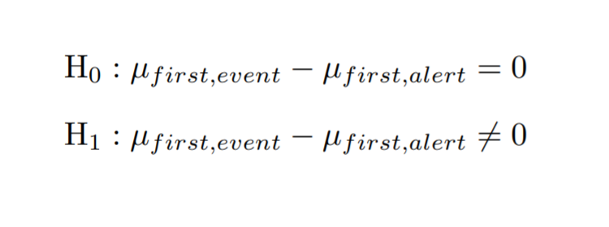

```{r setup, include=FALSE}
knitr::opts_chunk$set(echo = TRUE)
```

# Objetivo

El objetivo de esta práctica es realizar un estudio de un seguido de incidentes que han recibido diferentes empresas de distintos sectores para poder determinar quién los ha producido así como investigar de qué manera se han podido realizar para futuras prevenciones. Finalmente, se intentará ver si se pueden, o no, predecir estos.

Para poder llevar a cabo este estudio se dispone de datasets que nos han sido proporcionados. Por un lado, tenemos la información de los incidentes a estudiar i, por otro, la información de un seguido de estándares que nos ayudaran a poder sacar conclusiones sobre los incidentes.

## Datasets
```{r ds_mitre and ds_incidents, echo=TRUE, warning=FALSE, cache=TRUE, results='hide'}
mitre.data <- readRDS(file = "data/mitredata.rds")
#mitre.data <- mitre::getLatestDataSet()
incidents <- readRDS(file = "data/incidents.rds")
```

## Packages
Para la realización de este proyecto se usan los siguientes packages de r:
```{r load_packages, echo=TRUE, message=FALSE, warning=FALSE, results='hide'}
library("dplyr")
library("tidyr")
library("tidyverse")
library("DataExplorer")
library("ggridges")
library("ggplot2")
library("hrbrthemes")
library("viridisLite")
library("viridis")
library("dplyr")
library("readr")
library("packcircles")
library("ggiraph")
library("Hmisc")
library("kableExtra")
library("plotly")
library("lubridate")
library("data.table")
library("formattable")
```

# Análisis exploratorio de los incidentes

Para poder empezar nuestro estudio, inicialmente se presentará el análisis exploratorio de nuestro dataset incidents para poder ver con qué tipo de información estamos trabajando. 

Antes de empezar, por eso, vemos que tenemos una columna donde tenemos información en forma de matriz de modo que acabamos de arreglar el dataset con el que trabajaremos:


```{r ds_incidents, echo=TRUE, warning=FALSE, cache=TRUE, results='hide'}
incidents <- incidents %>% unnest(mitre_attack)
apply(incidents, 2, function(x) length(unique(x)))
incidents <- incidents %>%
  mutate_if(is.character, as.factor)
incidents <- dplyr::distinct(incidents)
```
```{r ds_incidents_ver, echo=FALSE, warning=FALSE, cache=TRUE}
kbl(incidents) %>%
  kable_paper() %>%
  scroll_box(width = "500px", height = "200px")
```
(dataframe incidents obtenido)  
  
     
     
Ahora, podemos proceder a hacer una primera visión de cuanta información y de qué tipo se trata:  

```{r ds_incidents_summary, echo=FALSE, warning=FALSE, cache=TRUE}
Hmisc::describe(incidents) %>% html()
```
   
   

## Estudio de las variables cualitativas    

### By first_event   
   
Para poder estudiar estas variables temporales, se ha decidido tratarlas como variables cuantitativas para su estudio. De ese modo, se ha optado por realizar, primeramente, un *bubbleplot* para ver qué meses o qué días del mes han sido más afectados.    

```{r by1event, echo=FALSE, fig.height=5, fig.width=6.5, message=FALSE, warning=FALSE}
fechas1 <- incidents[c(1)]
fechas1$first_event_ts <- date(ymd_hms(fechas1$first_event_ts))
fechas1$dia <- day(fechas1$first_event_ts)
fechas1$mes <- month(fechas1$first_event_ts)
fechas1 <- as.data.frame(table(fechas1[c(2,3)]))
fechas1$dia<-as.numeric(fechas1$dia)
fechas1$mes<-as.numeric(fechas1$mes)
ggplot(fechas1, aes(x=mes, y=dia, size = Freq, fill=dia)) +
  geom_point(alpha=0.5, shape=21, color="black") +
  scale_size(range = c(0, 25), name="Ataques por día") + 
  scale_fill_viridis(begin = 0.5, end = 1) +
  theme_ipsum() +
  ylab("Día") +
  xlab("Mes") +
  theme(legend.position = "none")

```
    
### By first_alert

Para esta variable realizaremos exactamente el mismo gráfico pues se trata del mismo tipo de variable.

```{r by1alert, echo=FALSE, fig.height=5, fig.width=6.5, message=FALSE, warning=FALSE}
fechas2 <- incidents[c(2)]
fechas2$first_alert_ts <- date(ymd_hms(fechas2$first_alert_ts))
fechas2$dia <- day(fechas2$first_alert_ts)
fechas2$mes <- month(fechas2$first_alert_ts)
fechas2 <- as.data.frame(table(fechas2[c(2,3)]))
fechas2$dia<-as.numeric(fechas2$dia)
fechas2$mes<-as.numeric(fechas2$mes)
ggplot(fechas2, aes(x=mes, y=dia, size = Freq, fill=dia)) +
  geom_point(alpha=0.5, shape=21, color="black") +
  scale_size(range = c(0, 25), name="Ataques por día") + 
  scale_fill_viridis(begin = 0, end = 0.5) +
  theme_ipsum() +
  ylab("Día") +
  xlab("Mes") +
  theme(legend.position = "none")

```
     
Podemos oberservar que entre los gráficos de ***first_event*** y ***first_alert***, a simple vista, no hay diferencia alguna. Aun así, en el siguiente apartado se calculará la diferencia entre los dos.   

### Inferencia estadística  
Para ver si hay diferencias significativas entre estas dos variables presentadas, se 
realiza el siguiente contraste de hipótesis:   

{height=100px}
    
Así, en la hipótesis nula supondremos que estas variables no presentan diferencias significativas y, si es refutada, entonces sí presentarán suficientes diferencias y las deberemos estudiar por separado de aquí en adelante.   

De ese modo, procedemos a ver si podemos realizar este estadístico de contraste bilateral con $\alpha = 0.05$. Para comprobarlo debemos verificar la normalidad de nuestros datos de modo que realizamos un histograma en forma de puntos:

```{r statshist, echo=FALSE, message=FALSE, warning=FALSE}
fechas1 <- incidents[c(1)]
fechas1$first_event_ts <- date(ymd_hms(fechas1$first_event_ts))
fechas2 <- incidents[c(2)]
fechas2$first_alert_ts <- date(ymd_hms(fechas2$first_alert_ts))
diffechas <- abs(difftime(fechas1$first_event_ts,fechas2$first_alert_ts,units=c("days")))
diffechas<- as.data.frame(diffechas)
diffechas$id = 1:length(diffechas$diffechas)
```
```{r plothist, echo=FALSE, message=FALSE, warning=FALSE}
diffechas$col<-character(length(diffechas$diffechas))
ax <- list(
  title = ""
  
)
pal <- c("#55C667FF")
f <- list(
  family = "Courier New, monospace",
  size = 12,
  color = "#7f7f7f"
)
x <- list(
  title = "Incidencia",
  titlefont = f
)
y <- list(
  title = "Diferencia entre first_event y first_alert",
  titlefont = f
)
figh <- plot_ly(diffechas, x = ~id, y = ~diffechas, name = 'Diferencia', type = 'scatter', mode = 'markers', color= ~col, colors = pal)
figh <- figh %>% layout(xaxis = x, yaxis = y)
figh
```

Podemos observar de manera muy clara que los datos no siguen una distribución normal de modo que no podremos realizar la inferencia estadística presentada. Aun así, podemos concluir que el los valores aislados no son favorables, es decir, ha habido un gran *delay* entre el día en el que se produjo el incidente y el día en el que se detectó. Veamos estos casos:   

```{r grandiff, echo=FALSE, message=FALSE, warning=FALSE}
grandiff <- filter( diffechas[c(1,2)], diffechas > 0)
grandiff <- grandiff %>%
    filter(!is.na(diffechas)) %>%
    arrange(desc(diffechas)) %>%
    mutate(id=factor(id, id))
```
```{r ojo, echo=FALSE, message=FALSE, warning=FALSE}
delayedg <-as.data.frame(incidents[c(grandiff$id),c(4,5,7,8)])
m1 <- cbind(delayedg, grandiff$diffechas)
colnames(m1)[5]="delay"
merge <- data.table::data.table(m1)
formattable::formattable(merge)
```
     
     
Podemos observar que la industria de **Manufacturing** es la que más tarda en comparación a las otras en detectar estos incidentes. Concretamente vemos que es la empresa ***ac33b693*** la que no detecta a tiempo las incidencias.    
Por otro lado, la empresa ***3c8cab02*** debería mejorar su detección puesto que llega a tardar 23 días en detectar una incidencia.   
Finalmente, la empresa ***ccf43f76*** es la única otra que tarda más que unas horas en detectarlas a tiempo. 

Menospreciando estos casos recién presentados, podemos considerar que estas dos columnas son iguales (en todos los otros casos la diferencia nos da 0). Se debe considerar así porque no se ha podido realizar el test presentado anteriormente. De haber sido los datos normales se hubiese ejecutado lo siguiente:

```{r statsbilat, echo=TRUE, results='hide'}
t.test( diffechas$diffechas,
        mu = 0, 
        alternative = "two.sided" ) # contraste bilateral

```


### By containtment    

Finalmente, se estudia la ultima columna, la cual también se trata de una variable temporal. Por sí sola no tiene mucho sentido estudiarla de modo que se relacionará con *first_event*. De ese modo, podremos ver la duración de las incidencias. 

```{r bycont, echo=FALSE, message=FALSE, warning=FALSE}
finicio <- sort(incidents$first_event_ts)
f1 <- as.data.frame(finicio)
f1$first_event_ts <- date(ymd_hms(f1$finicio))
ffin <- sort(incidents$containment_ts)
f2 <- as.data.frame(ffin)
f2$containment_ts <- date(ymd_hms(f2$ffin))
dur <- difftime(f2$ffin,f1$finicio,units=c("days"))
dur <- as.data.frame(dur)
dur$fecha <- finicio
dur$dur <- as.numeric(dur$dur, units="days")
pt <- dur %>%
  ggplot( aes(x=fecha, y=dur)) +
    geom_point(color="#69b3a2") +
    geom_line(color="#69b3a2", alpha=0.5) +
    ylab("Duración (días)") +
    xlab("Fecha inicio ataque") +
    theme_ipsum()
pt <- ggplotly(pt)
pt
```

Se puede observar que los ataques realizados a inicios de año (mes de enero) son con diferencia los que más han durado y que a partir del mes de abril los ataques ya han sido más cortos durando todos menos de 20 días. Para poder ver mejor que sucede entre los meses de abril a octubre, repetimos el gráfico anterior eliminando los casos de los dos primeros meses con duraciones desmesuradas:

```{r bycont2 , echo=FALSE, message=FALSE, warning=FALSE}
dur2 <- filter( dur, dur < 20)
pt2 <- dur2 %>%
  ggplot( aes(x=fecha, y=dur)) +
    geom_point(color="#453781FF", size=0.5) +
    geom_line(color="#453781FF", alpha=0.5) +
    ylab("Duración (días)") +
    xlab("Fecha inicio ataque") +
    theme_ipsum()
pt2 <- ggplotly(pt2)
pt2
```

Podemos ver que en los meses de julio y agosto también tenemos un despunte de la duración de estas incidencias. Se supone que es debido a la coincidencia temporal con las vacaciones de muchos de los trabajadores.   

A la vez, analizamos estas incidencias de alta duración (más de 20 días):

```{r bycont3, echo=FALSE, message=FALSE, warning=FALSE}
dur$id <- 1:length(dur$dur)
dur3 <- filter( dur, dur > 20)
altdur <-as.data.frame(incidents[c(dur3$id),c(4,5,7,8)])
m2 <- cbind(altdur, dur3$dur)
colnames(m2)[5]="duration"
merge2 <- data.table::data.table(m2)
formattable::formattable(merge2)
```

La empresa ***3c8cab02*** nos aparece de nuevo con casi 82 días de duración de una incidencia, la misma por la que tarda 23 días en detectarla, por lo tanto en realidad el tiempo de trabajo para esta incidencia T1192 es de 59 días (muchos días de todas formas).   
Por otro lado, de nuevo, vemos que la empresa ***ac33b693*** es la segunda que más ha tardado en resolver las incidencias.    

Anteriormente se ha visto que, como ya se ha mencionado, estas empresas eran la que más tardaban en detectarlas así que deberían mejorar sus equipos de detección y *management* de riesgos.

## Estudio de las variables cuantitativas

### By industries

Primeramente, se estudian las distintas industrias afectadas con un *bar plot* para poder ver cual de ellas es la más afectada.

```{r byindustriesplot, echo=FALSE, fig.height = 4, fig.width = 6, fig.align = "center", warning=FALSE}
#By Industries (categorical): Bar Chart
byindus <- table(incidents$industry)
indus <- as.data.frame(byindus)
ggplot(indus, aes(x=Var1, y=Freq)) +
  geom_bar(stat = "identity", fill="#2D708EFF") +
  coord_flip() + 
  theme_ipsum() +
  theme(axis.title.x = element_blank())+ 
  theme(axis.title.y = element_blank())

```

Se puede observar que las que más ataques han sufrido son ***Retail***, ***Professional*** y ***Manufacturing***. 

###  By organisations    

A continuación se realiza un *treemap* para ver las distintas empresas según su respectiva industria.   

```{r byorg, echo=FALSE, message=FALSE, warning=FALSE}
####ORg
incidents3 <- incidents %>%
  mutate(
    paste = paste(industry,"|",org)
  )
byorg <- table(incidents3$paste)
org <- as.data.frame(byorg)
org<-within(org, Var1<-data.frame(do.call('rbind', strsplit(as.character(Var1), ' | ', fixed=TRUE))))
org <- cbind(org$Freq, org$Var1$X1, org$Var1$X2)
org <- as.data.frame(org)
indus  <- data.frame(lapply(indus, as.character), stringsAsFactors=FALSE)
labels=c(indus$Var1, org$V3)
parents=c(character(19), org$V2)


fig <- plot_ly(
  type="treemap",
  labels=labels,
  parents=parents
  )
fig <- fig %>% layout(treemapcolorway=viridis(19, alpha = 1, begin = 0, end = 1, option = "D"))
fig
```

### By tactics   

Procedemos a estudiar las diferentes tácticas usadas con un *bar plot* circular:   

```{r bytacticsplot, echo=FALSE, fig.height=6, fig.width=6, warning=FALSE}
bytactics <- table(incidents$tactic)
tact <- as.data.frame(bytactics)
tmp <- tact %>%
  filter(!is.na(Freq)) %>%
  arrange(desc(Freq)) %>%
  mutate(Var1=factor(Var1, Var1))
# Set a number of 'empty bar'
empty_bar=10
# Add lines to the initial tmpset
to_add = matrix(NA, empty_bar, ncol(tmp))
colnames(to_add) = colnames(tmp)
tmp=rbind(tmp, to_add)
tmp$id=seq(1, nrow(tmp))

# Get the name and the y position of each label
label_tmp=tmp
number_of_bar=nrow(label_tmp)
angle= 90 - 360 * (label_tmp$id-0.5) /number_of_bar     # I substract 0.5 because the letter must have the angle of the center of the bars. Not extreme right(1) or extreme left (0)
label_tmp$hjust<-ifelse( angle < -90, 1, 0)
label_tmp$angle<-ifelse(angle < -90, angle+180, angle)
label_tmp$Var1 <- paste(label_tmp$Var1, " (", label_tmp$Freq,")", sep="")

# Make the plot
ggplot(tmp, aes(x=as.factor(id), y=Freq)) +       # Note that id is a factor. If x is numeric, there is some space between the first bar
  geom_bar(stat="identity", fill=alpha("#20A387FF", 1)) +
  ylim(-200,750) +
  theme_minimal() +
  theme(
    axis.text = element_blank(),
    axis.title = element_blank(),
    panel.grid = element_blank(),
    plot.margin = unit(rep(-1,4), "cm")
  ) +
  coord_polar(start = 0) +
  geom_text(data=label_tmp, aes(x=id, y=Freq+90, label=Var1 ), color="black", alpha=0.6, size=3.15, angle= label_tmp$angle, hjust=label_tmp$hjust, inherit.aes = FALSE ) 
```
   
Con clara diferencia, como se puede observar, la más recurrente es ***Execution***.   


### By techniques    
Por otro lado, realizamos un gráfico del tipo *circular packing* para representar qué técnicas son las más recurrentes:    

```{r bytechniquesplot, echo=FALSE, fig.height=2, fig.width=2, warning=FALSE}
#Techniques
incidents2 <- incidents %>%
  mutate(
    paste = paste(id,"|",technique)
  )
bytechniques <- table(incidents2$paste)
techniques <- as.data.frame(bytechniques)
names(techniques)[names(techniques) == "Var1"] <- "technique"
techniques<-within(techniques, technique<-data.frame(do.call('rbind', strsplit(as.character(technique), '|', fixed=TRUE))))
names(techniques)[names(techniques) == "Freq"] <- "value"
techniques$text <- paste("id: ",techniques$technique$X1, "\n","technique: ",techniques$technique$X2, "\n", "count:", techniques$value)
# Generate the layout
packing <- circleProgressiveLayout(techniques$value, sizetype='area')
data <- cbind(techniques$technique$X1, packing)
dat.gg <- circleLayoutVertices(packing, npoints=50)

# Make the plot with a few differences compared to the static version:
p<-ggplot() + 
  geom_polygon_interactive(data = dat.gg, aes(x, y, group = id, fill=id, tooltip = techniques$text[id], data_id = id), colour = "black", alpha = 0.85, fontface="bold") +
  scale_fill_viridis() +
  geom_text(data = data, aes(x, y, label = gsub("Technique", "", techniques$technique$X1)), size=5, color="black") +
  theme_void() + 
  theme(legend.position="none", plot.margin=unit(c(0,0,0,0),"cm") ) + 
  coord_equal() 
# Turn it interactive
widg <- ggiraph(ggobj = p, width_svg = 9, height_svg = 9,
                options = list(
                 opts_tooltip(use_fill = TRUE),
                 opts_sizing(width = 0.7),
                 opts_hover_inv(css = "opacity:0.2;")))
  
widg
```

Podemos observar que la técnica más usada es la ***T1072*** que corresponde a ***Third-party Software*** con count de 136. Por lo tanto, representa un 27,9% de los incidentes del estudio.    

## Relaciones entre variables y visión global


